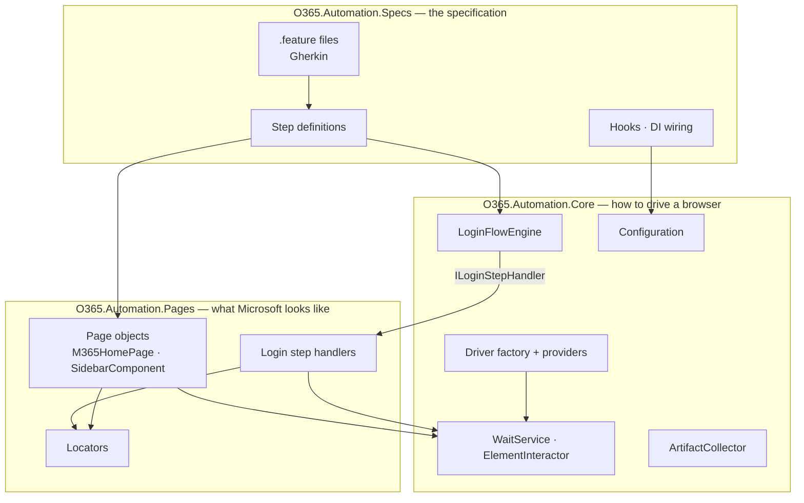
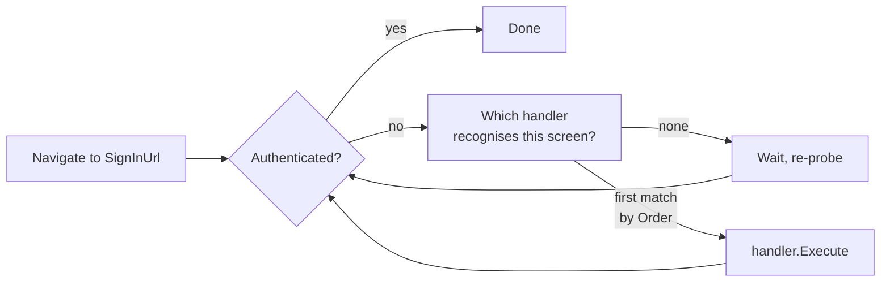
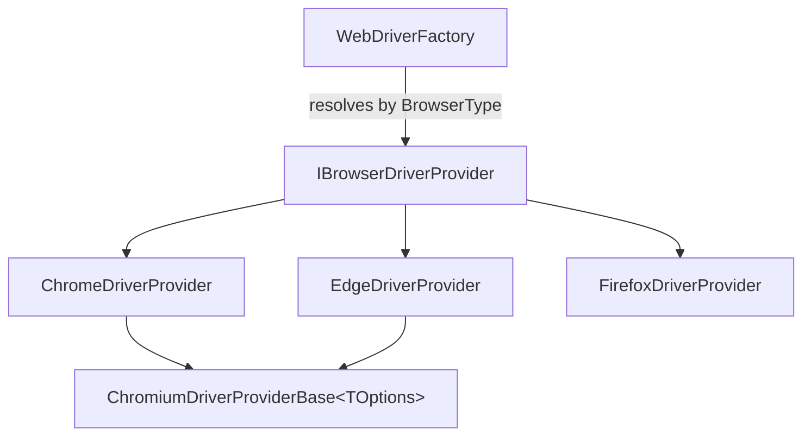
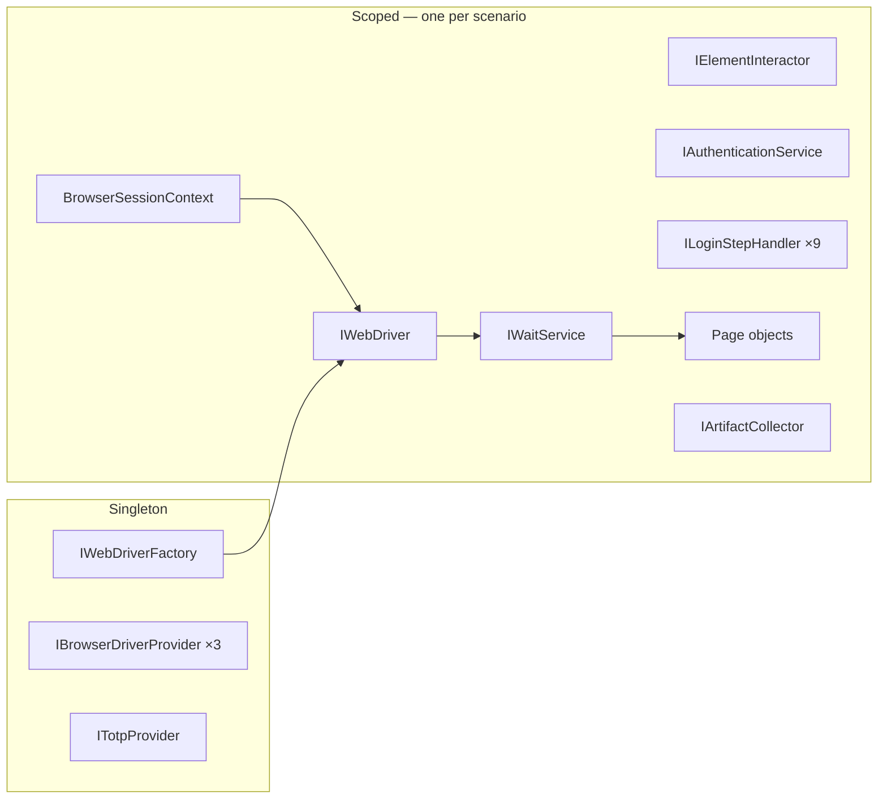

# Architecture

How the framework is put together, and — more usefully — *why*. Each decision below was made against a
specific failure mode; where a decision was forced by something we observed against a real tenant, that is
called out.

- [The shape](#the-shape)
- [Layering](#layering)
- [Sign-in as a state machine](#sign-in-as-a-state-machine)
- [The browser layer](#the-browser-layer)
- [Lifetimes: one scenario, one browser](#lifetimes-one-scenario-one-browser)
- [Waiting](#waiting)
- [Locators](#locators)
- [Configuration and secrets](#configuration-and-secrets)
- [Diagnostics](#diagnostics)
- [Decisions and their alternatives](#decisions-and-their-alternatives)
- [Known limits](#known-limits)

---

## The shape



The arrow that matters is `ENG --> LH`: **Core depends on the `ILoginStepHandler` abstraction, never on the
handlers themselves.** Core contains no Microsoft selector, no Reqnroll type, and no NUnit type. It would
drive a sign-in flow for any identity provider.

| Project | Responsibility | Knows about |
| --- | --- | --- |
| `O365.Automation.Core` | Browsers, waits, interactions, the sign-in engine, configuration, diagnostics | Selenium only |
| `O365.Automation.Pages` | Everything Microsoft-specific: selectors, sign-in screens, M365 pages | Core + Selenium |
| `O365.Automation.Specs` | The specification: features, steps, hooks | Core + Pages + Reqnroll |
| `O365.Automation.UnitTests` | Framework internals under test — no browser, no network | Core |

---

## Layering

The dependency rule is one-directional and enforced by project references:

```text
Specs ──▶ Pages ──▶ Core
   └───────────────────▶ Core
```

Two consequences that were worth designing for:

**Core is reusable without Reqnroll.** If BDD is ever dropped, or a console runner is added, or someone
wants to drive M365 from a background job, none of Core or Pages changes. The specification layer is a
consumer, not a foundation.

**The unit tests are honest.** They test Core in isolation with no browser and no network, which is why
they run in ~150 ms and are meaningful on a fresh clone with no credentials.

---

## Sign-in as a state machine

This is the central design decision, and it was forced by the domain.

**Entra ID's sign-in is not a fixed sequence.** Depending on tenant policy, account type, machine join
state and browser mode, a single sign-in may present: an account picker, a work-or-personal chooser, a
password prompt, a push-approval screen, a code prompt, a "Stay signed in?" prompt — or none of them. A
linear script (`type email → click next → type password → …`) is wrong the moment reality differs, and
reality differs constantly.

So each screen is a self-recognising handler, and the engine loops:

```csharp
public interface ILoginStepHandler
{
    int  Order { get; }                            // priority when several match
    bool IsCurrentScreen(LoginContext context);    // fast, non-blocking probe
    void Execute(LoginContext context);            // advance past this screen
}
```



`LoginFlowEngine` contains **no Microsoft markup**. It asks "which screen is showing?", lets the winner act,
and repeats until an authenticated URL is reached.

### Why the ordering exists

| Order | Handler | Why it sits here |
| --- | --- | --- |
| 0 | `LoginError` | **Must outrank everything.** A rejected password renders the error banner *on the password screen*. Without priority, the flow would simply retype the bad password until the loop guard tripped — and report "stalled" instead of "your password is wrong". |
| 5 | `AccountPicker` | Must precede `Username`: the picker has to be dismissed before an email field exists at all. |
| 10 | `Username` | |
| 20 | `WorkAccountTile` | |
| 30 | `Password` | |
| 35 | `InteractiveMfa` | **Outranks the other MFA steps.** When a human is answering the challenge, we must not reshape the screen underneath them mid-approval. |
| 40 | `ChooseVerificationMethod` | Must precede `Totp`: it is what converts a push-approval screen into a code prompt. |
| 50 | `Totp` | |
| 60 | `StaySignedIn` | |

### The payoff, demonstrated

When the suite was first run against a real tenant in **Normal** (non-private) mode on an Entra-joined
machine, Entra ID answered with "Pick an account" offering the machine's own Windows identity. Supporting
it took **one new class and one registration line**. No existing code changed. That is the whole point of
the design.

### Guard rails

- **Loop guard.** One screen handled more than three times means the flow is not progressing (usually a
  wrong credential with no parseable error). The engine fails with a diagnosis rather than burning the
  timeout.
- **Deadline re-check.** The login deadline is only tested *between* steps, so one long step can overrun it
  — interactive MFA routinely does, because it is waiting on a person. The engine re-checks authentication
  before failing, so it can never report "sign-in timed out" after you have in fact signed in.

---

## The browser layer

One provider per browser, selected by a factory that knows about none of them:



Adding a browser means adding a class and registering it. `WebDriverFactory` never changes — it just looks
up the provider for the requested `BrowserType` and applies cross-cutting policy (page-load timeout).

Chrome and Edge share `ChromiumDriverProviderBase<TOptions>`, differing only in three things: their options
type, their private-browsing switch (`--incognito` vs `--inprivate`), and the driver they construct.
Firefox is deliberately *not* a subclass — it has no `--start-maximized`, and its downloads and profile are
driven by `about:config` preferences rather than user-profile preferences, so pretending it is Chromium
would cost more than it saved.

Driver binaries are resolved by **Selenium Manager** (built into Selenium 4.6+). There is nothing to
download, pin, or keep in step with browser updates.

### Why InPrivate is the default

A **Normal** session on a domain- or Entra-joined machine offers the signed-in Windows identity via seamless
SSO. Accepting it would silently run the suite as whoever is logged into the build agent — different
account, different licences, different permissions — producing failures that are near-impossible to
diagnose.

`AccountPickerStepHandler` always declines ("Use another account"), so the framework authenticates as the
account it was configured with. **InPrivate avoids the situation entirely**, which is why it is the default.
`Normal` remains available, with `Browser:UserDataDirectory`, for when a persistent signed-in profile is
genuinely wanted.

---

## Lifetimes: one scenario, one browser



**Everything that touches a browser is scoped, and one DI scope == one scenario == one browser.** Reqnroll's
DI plugin creates a scope per scenario and disposes it afterwards; `IWebDriver` is scoped and
`IDisposable`, so disposing the scope quits the browser.

The consequence is structural rather than procedural: **a leaked browser process requires a leaked scope,
not a forgotten teardown.** No hook has to remember to call `Quit()`.

`IWebDriver` is registered with a factory lambda so it resolves **lazily** — the browser launches on first
use, not when the scope opens. That is what allows `BrowserSessionContext.Use(...)` to override the browser
choice after the container is built but before anything launches.

### `BrowserSessionContext` and the copy that isn't an accident

`BrowserSettings` arrives from `IOptions<T>` as a **shared singleton instance**. Mutating it to change one
scenario's browser would leak that choice into every subsequent scenario. `BrowserSessionContext` therefore
takes a defensive copy — including the `AdditionalArguments` list, which would otherwise still be shared by
reference. Both behaviours are pinned by unit tests, because the failure they prevent is silent.

It also carries `DriverLaunched`. Teardown needs it: a failure hook that resolved `IArtifactCollector` to
take a screenshot would **launch a browser during teardown** just to photograph a scenario that never opened
one.

---

## Waiting

All waiting goes through `IWaitService`. Page objects and handlers never construct a `WebDriverWait`.

- **Implicit waits are pinned at zero.** Mixing implicit and explicit waits produces compounding,
  unpredictable timeouts. This is a deliberate, load-bearing decision, not an omission.
- `NoSuchElement` and `StaleElementReference` are polled *through*, not propagated: on an SPA mid-render they
  mean "not ready yet", not "failed".
- `IsDisplayed(By)` is **non-blocking**. It is the primitive the login handlers use to ask "is my screen the
  one showing?" — the engine probes every handler on every poll, so a per-locator wait there would cost
  minutes per sign-in.
- `FirstDisplayedOrDefault(IEnumerable<By>)` backs the multi-locator strategy below.

Conditions are hand-written rather than taken from `DotNetSeleniumExtras.WaitHelpers`, which has been
unmaintained for years and is a routine finding in enterprise dependency audits.

---

## Locators

Microsoft reskins these pages without notice and A/B-tests variants across tenants. So **every element is an
ordered list of candidate locators** — a stable element id first, then attribute and text fallbacks —
resolved by `FirstDisplayedOrDefault`, which takes the first that matches.

They target the **accessibility contract** (`role`, `aria-label`, `title`) rather than generated CSS class
names, because that is what screen readers depend on and is therefore the most stable thing on the page.

When a Microsoft UI change breaks the suite, exactly two files should need editing:

- [`MicrosoftLoginLocators`](../src/O365.Automation.Pages/Login/MicrosoftLoginLocators.cs)
- [`SidebarLocators`](../src/O365.Automation.Pages/M365/SidebarLocators.cs)

---

## Configuration and secrets

One file per concern, because they have genuinely different lifecycles — and separate files let
`.gitignore` draw the line precisely.

```text
application.json ─┐
browser.json      ├─ committed, reviewed
timeouts.json     │
mfa.json         ─┘
credentials.json ──── git-ignored   (real account)
local.json ────────── git-ignored   (machine overrides)
user-secrets ──────── outside the repo entirely
environment ───────── CI secret store
```

Later sources override earlier ones. The point of the ordering: **the username can sit in a file while the
password and TOTP secret stay out of every file** — user-secrets locally, `Credentials__Password` /
`Credentials__TotpSecret` from the pipeline's secret store in CI.

**No secret ever needs to exist inside the repository.** `credentials.template.json` is committed and must
only ever contain empty values; `credentials.json` beside it is ignored. That is the entire reason the two
are separate files.

The layering lives in `AutomationConfigurationBuilder` in **Core**, not in the test project, so a console
runner or a second suite reuses it unchanged.

---

## Diagnostics

Any failing scenario writes a **screenshot and a DOM dump** to `TestArtifacts/`, wired into the Reqnroll
teardown hook rather than left to individual steps to remember. A failed UI test with no evidence is close
to undebuggable.

This is not decoration. Both of the real bugs found during development were diagnosed from these artifacts:
the anonymous marketing page, and the SSO account picker.

Artifact capture never masks the real failure — a capture that throws is logged and swallowed, because the
test's own exception is what matters.

---

## Decisions and their alternatives

| Decision | Alternative rejected | Why |
| --- | --- | --- |
| Step-handler state machine | Linear sign-in script | Entra ID's screens vary by tenant, account and machine. A script is wrong the moment reality differs. |
| Reqnroll | SpecFlow | SpecFlow was retired end-2024 and never supported .NET 8+. Reqnroll is its maintained successor, same Gherkin. |
| Cucumber Messages + HTML formatter | SpecFlow+ LivingDoc | Died with SpecFlow. The replacement needs no licence. |
| InPrivate by default | Normal | Normal offers the machine's Windows identity via SSO. Silent wrong-account runs are the worst kind of failure. |
| Interactive MFA = watch the browser | Prompt for a code on the console | Under `dotnet test` stdin is redirected: `Console.ReadLine()` returns null. Watching the browser also supports *every* authenticator type, not just TOTP. |
| Hand-written wait conditions | `DotNetSeleniumExtras.WaitHelpers` | Unmaintained for years; a standard dependency-audit finding. |
| Explicit waits only | Implicit + explicit | Mixing them compounds timeouts unpredictably. |
| Multi-locator chains | Single "best" selector | Microsoft changes this markup without notice. |
| Selenium Manager | WebDriverManager / checked-in binaries | Built into Selenium 4.6+; nothing to pin or update. |
| Unit tests stay NUnit | Everything in Gherkin | "A Base32 secret produces a six-digit code" has no stakeholder audience. BDD is for behaviour, not plumbing. |

---

## Known limits

Stated plainly, because a guide that overstates confidence is worse than none.

- **The sidebar locators are unverified.** Nothing has yet run against an authenticated tenant, so
  [`SidebarLocators`](../src/O365.Automation.Pages/M365/SidebarLocators.cs) is an educated guess — resilient
  by construction (accessibility attributes, fallback chains), but a guess. The sign-in path *is* verified
  as far as the credential screen.
- **Scenarios run sequentially.** Entra ID throttles rapid repeated sign-ins from one account; parallel
  scenarios against a single test account produce authentication failures that look like product bugs.
  Raise parallelism only alongside a pool of distinct test accounts.
- **Interactive MFA cannot run headless or in CI.** By definition — there would be no window to act in. The
  handler fails fast with that explanation rather than hanging.
- **The rail is licence- and tenant-dependent.** Assertions deliberately avoid pinning an exact set of
  navigation items; doing so would fail on a tenant that is merely configured differently rather than broken.
